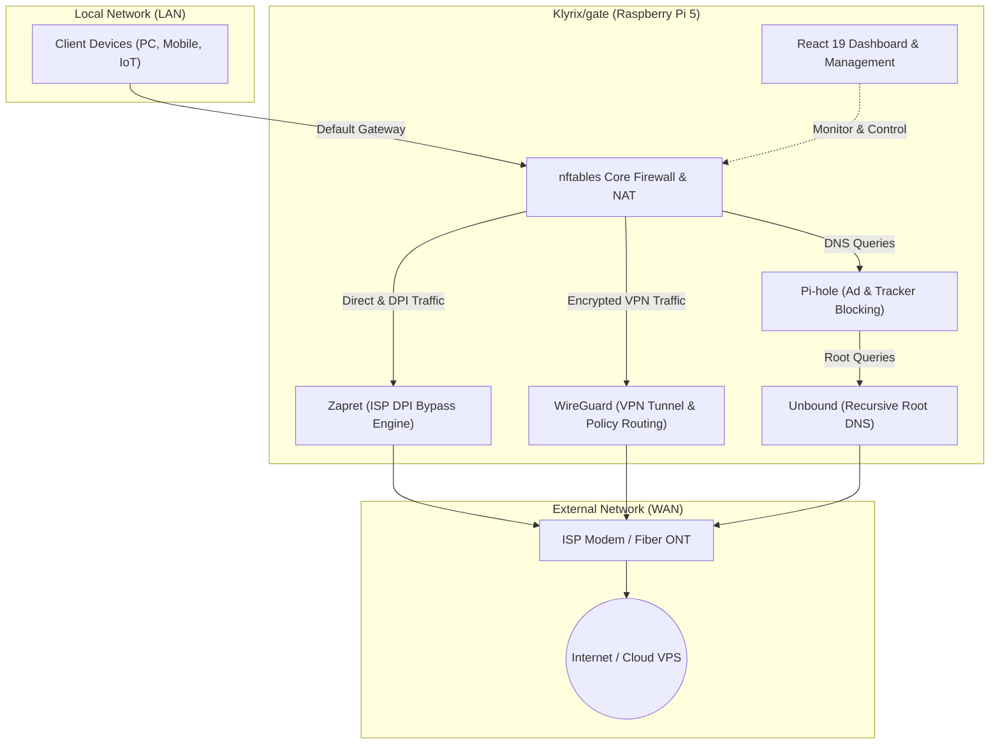

<div align="center">

# 🛡️ Klyrix/gate
### Next-Generation Open-Source Edge Security & Network Gateway for Raspberry Pi 5

<p align="center">
  🌐 <b>Languages / Diller:</b>
  <a href="README.md"><b>English</b></a> •
  <a href="README.tr.md"><b>Türkçe</b></a>
</p>

<p align="center">
  <a href="https://github.com/Ea2601/klyrix-gate/releases"></a>
  <a href="LICENSE"></a>
  
  
  
  
</p>

<p align="center">
  <b>Klyrix/gate</b> transforms your Raspberry Pi 5 into an enterprise-grade hardware gateway, deep packet inspection (DPI) bypass engine, DNS shield, and WireGuard VPN orchestrator with a single command.
</p>

<p align="center">
  <b>100% Free • Open Source • No Subscriptions • Completely Self-Hosted & Privacy-First</b>
</p>

<p align="center">
  <a href="#-quick-installation">🚀 Quick Install</a> •
  <a href="#-system-architecture">🏛️ Architecture</a> •
  <a href="#-core-features">⚡ Features</a> •
  <a href="#-comparison-matrix">📊 Comparison</a> •
  <a href="#-community--contributing">🤝 Contributing</a>
</p>

---

</div>

## 💡 Why Klyrix/gate?

Network security and privacy shouldn't require thousands of dollars in enterprise hardware or recurring cloud licenses. Off-the-shelf ISP modems offer virtually no protection, while legacy firewall appliances require bulky x86 hardware and complex setup.

**Klyrix/gate** bridges this gap for homelab enthusiasts, remote workers, and small offices by providing commercial-grade networking capabilities on a compact, energy-efficient Raspberry Pi 5:

- **Zero Telemetry & Local Sovereignty:** No metrics, DNS logs, or traffic signatures ever leave your hardware. Everything runs locally on your Pi 5 with an embedded SQLite database.
- **Hardware-Level DPI Bypass (Zapret):** Defeats ISP-level Deep Packet Inspection and SNI filtering right at the gateway kernel.
- **Unified Security Stack:** Pi-hole ad-blocking, Unbound recursive DNS, nftables firewall, WireGuard VPN tunnels, and a sleek React 19 UI in one cohesive ecosystem.

---

## 📊 Comparison Matrix

| Feature | Standard ISP Modem | pfSense / OPNsense | Klyrix/gate (Pi 5) |
| :--- | :---: | :---: | :---: |
| **Cost** | Free / Rental Fee | Free (Requires expensive PC) | **100% Free & Open Source** |
| **Hardware Footprint** | Low (ISP Locked) | Bulky x86_64 Server | **Compact ARM64 (Raspberry Pi 5)** |
| **ISP DPI Bypass (Zapret)** | ❌ None | ⚠️ Manual & Complex | **Built-in & 1-Click Toggle** |
| **Network-Wide Ad Shield** | ❌ None | Plugin (pfBlockerNG) | **Integrated Pi-hole + Unbound** |
| **Modern User Interface** | Clunky / Slow | Legacy PHP Dashboard | **React 19 + TypeScript (Real-Time)** |
| **ICMP Redirect Hardening** | ❌ Vulnerable | Configurable | **Hardened by Default** |
| **Setup Time** | - | 45-60 Minutes | **~5 Minutes (Single Script)** |

---

## 🏛️ System Architecture

Klyrix/gate acts as an intelligent intermediary between your local network clients and the WAN:



---

## ⚡ Core Features

### 🛡️ 1. Cyber Defense & Kernel Firewall
- **nftables L3/L4 Firewall:** Persistent rulesets surviving reboots, automatic masquerading/NAT, and ICMP redirect suppression to prevent clients from bypassing gateway rules.
- **Zapret DPI Engine:** Circumvents deep packet inspection and SNI blocking techniques employed by restrictive ISPs.
- **Fail2Ban Intrusion Prevention:** Protects SSH by dynamically banning abusive IPs; repeat offenders are banned for a week, and the home network is exempt so you cannot lock yourself out. Settings are applied to Fail2Ban from the panel.

### 🌐 2. DNS Sovereignty & Ad Sinkhole
- **Pi-hole Integration:** Network-wide telemetry, tracker, and malicious domain blocking with live query logs and custom blocklists.
- **Unbound Recursive Resolver:** Queries authoritative root name servers directly over DNSSEC, eliminating third-party DNS surveillance (Google, Cloudflare).

### 🚀 3. VPN Tunnels & Hybrid Routing
- **WireGuard VPS Bridge:** One-click tunnel provisioning to remote VPS endpoints, configuration management, and instant mobile QR code generation.
- **Policy-Based Routing:** Route specific applications, domains or ready-made lists (adult / gambling) either directly through your ISP or encrypted through a WireGuard tunnel to your VPS — with optional DPI bypass, a per-rule kill-switch and, for applications, scheduled time windows.
- **Dynamic DNS (DDNS):** Automatic IP synchronization with Cloudflare, DuckDNS, and No-IP.

### 📊 4. Network Observability & Device Intelligence
- **Mesh Topology & Discovery:** Automatic LAN host discovery, custom naming and device groups, and instant device isolation/blocking.
- **Bandwidth, Speed Limits & Quotas:** Real-time throughput per device; per-device download / upload speed limits and daily / monthly quotas (when used up, internet is cut or slowed until the period resets), alerts at 80% and 100%. Enforced on the Pi with nftables.
- **Integrated Speedtest:** Benchmark your WAN and VPN throughput directly from the gateway hardware.
- **Parental Controls:** Schedule internet access times and block entire service categories per child device.

### 💻 5. Modern Operator Experience
- **React 19 Glassmorphic Dashboard:** Real-time hardware telemetry (CPU temp, RAM, storage, network rates) with dark-mode slate styling.
- **Web SSH Terminal:** Secure browser-based shell access to your Pi 5 with curated maintenance commands and zero external client requirements.

---

## 🚀 Quick Installation

### Automated 1-Line Installer (On your Raspberry Pi 5)

Open a terminal on your Raspberry Pi OS (Bookworm / Debian 13) and execute:

```bash
sudo bash -c "$(curl -fsSL https://raw.githubusercontent.com/Ea2601/klyrix-gate/master/install.sh)"
```

*The installer will resolve dependencies (Node.js, Pi-hole, nftables, WireGuard, Zapret), configure network daemons, compile the UI, and start the systemd services automatically.*

**Install options** — set as environment variables, e.g. `sudo KLYRIX_BUILD=prebuilt bash -c "$(curl -fsSL https://raw.githubusercontent.com/Ea2601/klyrix-gate/master/install.sh)"`:

| Variable | Values | Effect |
|---|---|---|
| `KLYRIX_BUILD` | `auto` (default), `local`, `prebuilt` | `prebuilt` downloads the panel that GitHub Actions built for the exact same commit, so the device never runs the TypeScript / Vite build (~400 MB RAM). `auto` uses it on 1 GB-class devices and smaller and builds locally above that. Saved to `/etc/pi5-gateway/build-mode`; change it later under Settings → System Update → Update Method. |
| `KLYRIX_PROFILE` | `lite`, `standard` | Overrides the memory-based hardware profile (`lite` = 512 MB class: no HDMI kiosk display). Saved to `/etc/pi5-gateway/profile`. |

*Prebuilt packages:* the device checks the SHA256 sum (it only catches corrupted or truncated downloads), the archive layout and that the package names the commit being installed; it cannot prove who built it. Prebuilt mode therefore trusts GitHub Actions and everyone who can publish releases on the repository the device was installed from. Forks publish their own packages only after Actions is enabled on the fork (Actions tab).

**Supported hardware**
- Raspberry Pi 5, 4 and 3; Raspberry Pi Zero 2 W with a USB Ethernet adapter. Use a 64-bit OS — on 512 MB boards such as the Zero 2 W it is effectively required: `sqlite3` ships no pre-built armhf binary, so a 32-bit system compiles it from source, which needs about 400 MB of free RAM during installation and again whenever `sqlite3` is upgraded.
- x86_64 PCs running Debian 13 with NetworkManager (installed automatically when missing).
- Debian 12 (Bookworm) works with limits.

### Manual / Git Setup

```bash
git clone https://github.com/Ea2601/klyrix-gate.git
cd klyrix-gate
sudo chmod +x install.sh
sudo ./install.sh
```

---

## 🛠️ Local Development

To contribute or customize the user interface and backend:

```bash
# Clone the repository
git clone https://github.com/Ea2601/klyrix-gate.git
cd klyrix-gate

# 1. Start the Backend API
cd backend
npm install
npm run dev

# 2. Start the Frontend App (in a separate terminal)
cd ../frontend
npm install
npm run dev
```

- **Frontend:** `http://localhost:3000`
- **Backend API:** `http://localhost:3001`

---

## 🔒 Privacy & Security Pledge

Klyrix/gate strictly adheres to core open-source principles:

1. **Zero External Telemetry:** No analytics scripts, no phone-home mechanisms, no crash analytics sent to third parties.
2. **Local Storage Only:** Device lists, network counters, and security rules reside exclusively inside your local SQLite database on the Pi 5.
3. **Auditable Codebase:** All operational scripts, firewall rules, and backend routes are located in transparent, readable files in [scripts/](scripts/) and [backend/](backend/).

---

## 🤝 Community & Contributing

Klyrix/gate is built by and for the open-source community. Contributions of any kind are warmly welcomed!

- **⭐ Star the Project:** If Klyrix/gate helps protect your network, please star the repository on GitHub to help others find it.
- **🐛 Report Bugs:** Open an issue on [GitHub Issues](https://github.com/Ea2601/klyrix-gate/issues) with log details.
- **💡 Feature Requests:** Share your ideas and join discussions.
- **🔀 Pull Requests:** Improvements to docs, UI components, or firewall logic are always appreciated.

---

## 🙏 Upstream Projects & Acknowledgments

Klyrix/gate is an orchestration and management platform built upon the foundation of outstanding open-source projects. We stand on the shoulders of giants and express our deepest gratitude to the creators and maintainers of these core technologies:

| Project | Role in Klyrix/gate | Upstream License | Project Link |
| :--- | :--- | :---: | :--- |
| **Pi-hole®** | DNS sinkhole, domain blocking & query telemetrics | EUPL v1.2 | [pi-hole.net](https://pi-hole.net) |
| **Unbound** | Validating recursive DNS resolver (Root DNS queries) | BSD 3-Clause | [nlnetlabs.nl](https://nlnetlabs.nl/projects/unbound) |
| **Zapret** | ISP DPI / SNI bypass & packet manipulation engine | MIT / GPL | [bol-van/zapret](https://github.com/bol-van/zapret) |
| **WireGuard®** | High-performance, modern encrypted VPN tunneling | GPLv2 | [wireguard.com](https://www.wireguard.com) |
| **nftables** | Linux kernel packet classification, NAT & filtering | GPLv2 | [netfilter.org](https://netfilter.org/projects/nftables) |
| **Fail2Ban** | Automated daemon intrusion prevention & rate-limit ban | GPLv2 | [fail2ban.org](https://www.fail2ban.org) |

### ⚖️ Legal & Trademark Disclaimers
- **Pi-hole®** is a registered trademark of Pi-hole LLC. Klyrix/gate is an independent integration and is not affiliated with, endorsed by, or sponsored by Pi-hole LLC.
- **WireGuard®** and the WireGuard logo are registered trademarks of Jason A. Donenfeld. Klyrix/gate is an independent project and is not sponsored or endorsed by Jason A. Donenfeld.
- **Raspberry Pi®** is a trademark of Raspberry Pi Ltd.
- All other trademarks, service marks, and company names are the property of their respective owners.

---

## 📄 License

This project is licensed under the **[MIT License](LICENSE)**. It is 100% free and open source for personal, commercial, and educational use.
