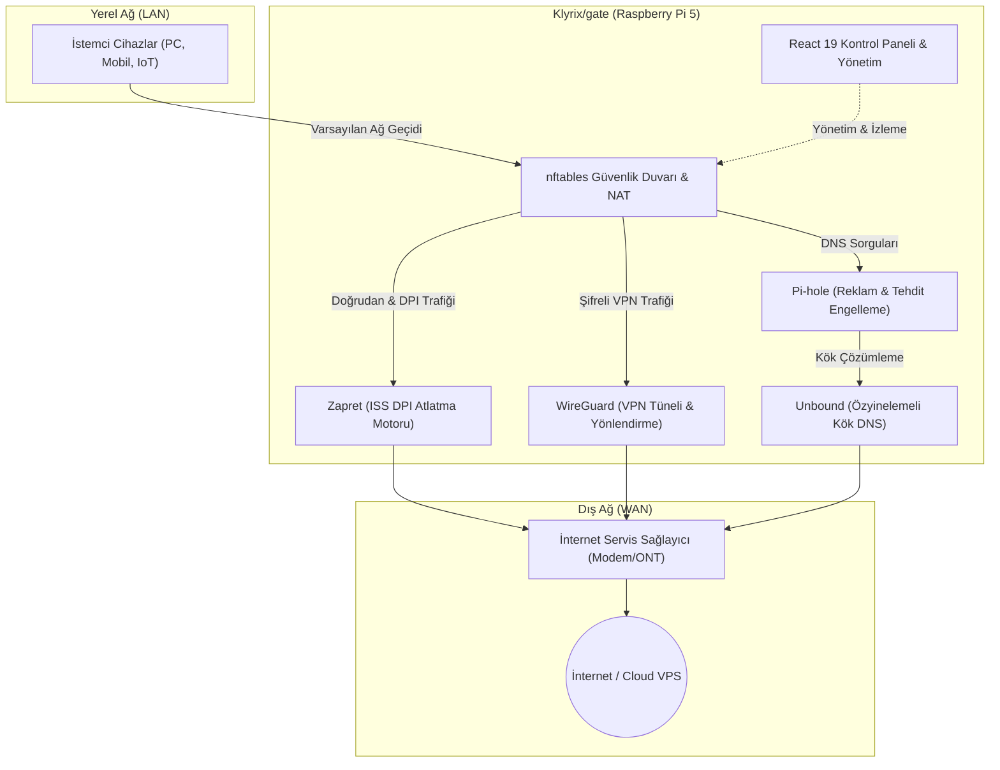

<div align="center">

# 🛡️ Klyrix/gate
### Açık Kaynaklı, Yeni Nesil Akıllı Ağ Güvenlik Ağ Geçidi
*Enterprise-Grade Open Source Edge Security & Network Gateway for Raspberry Pi 5*

<p align="center">
  🌐 <b>Diller / Languages:</b>
  <a href="README.md"><b>English</b></a> •
  <a href="README.tr.md"><b>Türkçe</b></a>
</p>

<p align="center">
  <a href="https://github.com/Ea2601/klyrix-gate/releases"></a>
  <a href="LICENSE"></a>
  
  
  
  
</p>

<p align="center">
  <b>Klyrix/gate</b>, Raspberry Pi 5 donanımınızı tek satır komutla pahalı kurumsal güvenlik cihazlarına (firewall appliance) taş çıkartan bir ağ geçidine, DPI bypass motoruna, DNS kalkanına ve WireGuard VPN orkestratörüne dönüştürür.
</p>

<p align="center">
  <b>%100 Ücretsiz • Açık Kaynaklı • Aboneliksiz • Yerel ve Gizlilik Odaklı (Self-Hosted)</b>
</p>

<p align="center">
  <a href="#-hızlı-kurulum">🚀 Hızlı Kurulum</a> •
  <a href="#-sistem-mimarisi">🏛️ Mimari</a> •
  <a href="#-temel-özellikler">⚡ Özellikler</a> •
  <a href="#-klyrixgate-vs-geleneksel-çözümler">📊 Karşılaştırma</a> •
  <a href="#-açık-kaynak-topluluğu-ve-katkı">🤝 Topluluk & Katkı</a>
</p>

---

</div>

## 💡 Neden Klyrix/gate?

Ağ güvenliği ve gizliliği bir lüks değil, temel bir haktır. Geleneksel modemler yetersiz güvenlik ve sıfır kontrol sunarken, ticari kurumsal güvenlik duvarları yüksek donanım ve lisans maliyetleri gerektirir.

**Klyrix/gate**, ev kullanıcılarına, laboratuvar meraklılarına (homelab) ve küçük işletmelere kurumsal seviyede ağ egemenliğini **tamamen ücretsiz ve açık kaynaklı** olarak sunar:

- **Sıfır Telemetri & Yerel Egemenlik:** Ağ trafiğiniz, DNS sorgularınız veya cihaz kayıtlarınız asla üçüncü taraf bulutlara gönderilmez. Tüm veriler Pi 5 üzerindeki yerel SQLite veritabanında saklanır.
- **DPI Atlatma Gücü (Zapret):** Servis sağlayıcı seviyesinde uygulanan kısıtlama ve Deep Packet Inspection (DPI) filtrelemelerini çekirdek seviyesinde bypass eder.
- **Hepsi Bir Arada Entegrasyon:** Pi-hole, Unbound DNS, nftables, WireGuard ve modern bir React 19 arayüzü sıfır yapılandırma sürtünmesiyle bir araya gelir.

---

## 📊 Klyrix/gate vs. Geleneksel Çözümler

| Özellik | Standart ISS Modemi | pfSense / OPNsense | Klyrix/gate (Pi 5) |
| :--- | :---: | :---: | :---: |
| **Maliyet** | Ücretsiz (Kiralık) | Yüksek Donanım Maliyeti | **%100 Ücretsiz & FOSS** |
| **Donanım Uyumluluğu** | Kapalı Kutu | x86_64 Sunucu Gerekir | **Raspberry Pi 5 Optimize (ARM64)** |
| **ISP DPI Bypass (Zapret)** | ❌ Desteklemez | ⚠️ Manuel / Çok Zor | **Dahili & Tek Tıkla Aktif** |
| **DNS Reklam & Takip Kalkanı**| ❌ Yok | Eklenti (pfBlockerNG) | **Entegre Pi-hole + Unbound** |
| **Kullanıcı Deneyimi (UI)** | İlkel / Yavaş Web Arayüzü | Karmaşık / Eski PHP Arayüzü | **React 19 + TypeScript (Anlık Veri)** |
| **Yedekli Ağ Geçidi Koruması** | ❌ Yok | Karmaşık Kurallar | **ICMP Redirect Kalkanı Dahili** |
| **Kurulum Süresi** | - | 45-60 Dakika | **~5 Dakika (Tek Komut)** |

---

## 🏛️ Sistem Mimarisi

Klyrix/gate, yerel ağınızdaki istemciler ile internet arasında modern bir koruma kalkanı ve yönlendirme merkezi kurar:



---

## ⚡ Temel Özellikler

### 🛡️ 1. Ağ & Siber Güvenlik
- **nftables Çekirdek Güvenlik Duvarı:** Yeniden başlatmalarda kalıcı kural setleri, NAT, port yönlendirme ve modem/ağ bypass girişimlerini engelleyen ICMP redirect koruması.
- **Zapret DPI Bypass:** Servis sağlayıcıların SNI ve TCP paket incelemelerine karşı paket manipülasyonu ile engelleri aşma.
- **Fail2Ban Saldırı Önleme:** SSH'a yönelik yetkisiz giriş denemelerini algılayarak IP seviyesinde bloklama; tekrarlayanlara 1 hafta yasak, ev ağı muaf (kendinizi kilitleyemezsiniz). Ayarlar panelden Fail2Ban'a uygulanır.

### 🌐 2. DNS Egemenliği & Reklam Engelleme
- **Pi-hole Entegrasyonu:** Ağ seviyesinde reklam, izleyici ve kötü amaçlı yazılım alan adlarını engelleme, canlı sorgu kaydı ve blokliste yönetimi.
- **Unbound Recursive DNS:** Dış DNS sağlayıcılarına (Google, Cloudflare) güvenmek yerine doğrudan DNS kök sunucularıyla şifreli doğrulama.

### 🚀 3. Tünelleme, VPN & Trafik Yönetimi
- **WireGuard VPS Köprüsü:** Tek tıkla VPS tüneli kurma, istemci yapılandırmaları ve mobil cihazlar için anlık QR kod üretimi.
- **Politika Bazlı Yönlendirme (Policy Routing):** Belirli uygulamaların, alan adlarının ya da hazır listelerin (yetişkin / kumar) trafiğini yerel internete ya da VPS'e giden şifreli WireGuard tüneline yönlendirme; kural başına DPI atlatma ve kill-switch, uygulamalar için zaman pencereleri.
- **Dinamik DNS (DDNS):** Cloudflare, DuckDNS ve No-IP entegrasyonu ile değişen IP adresinizi otomatik güncelleme.

### 📊 4. Canlı Ağ Haritası & Gözlemlenebilirlik
- **Ağ Topolojisi & Cihaz Keşfi:** Ağdaki tüm bağlı cihazları otomatik keşfetme, özel isim/grup atama ve tek tıkla ağdan izole etme.
- **Bant Genişliği, Hız Sınırı ve Kota:** Cihaz başına anlık veri tüketimi; cihaz başına indirme / yükleme hız sınırı ve günlük / aylık kota (dolunca internet kesilir ya da yavaşlatılır, dönem başında kendiliğinden kalkar), %80 ve %100'de uyarı. Pi'de nftables ile uygulanır.
- **Dahili Hız Testi:** Ağ geçidi üzerinden doğrudan internet bağlantı hızını ölçümleme.
- **Ebeveyn Kontrolü:** Belirli cihazlar için zaman kısıtlamaları ve güvenli internet profilleri.

### 💻 5. Sistem & Modern Yönetim Deneyimi
- **React 19 & Tailwind/Slate UI:** Canlı WebSocket metrikleri (CPU sıcaklığı, RAM, disk, ağ yükü), karanlık mod ve akıcı cam efekti (glassmorphism).
- **Web SSH Terminali:** Pi 5'e fiziksel klavye/ekran bağlamadan tarayıcı üzerinden güvenli komut satırı erişimi ve hazır operasyon scriptleri.

---

## 🚀 Hızlı Kurulum

### Tek Komutla Otomatik Kurulum (Raspberry Pi 5 üzerinde)

Raspberry Pi OS (Bookworm / Debian 13) kurulu cihazınızda terminali açın ve çalıştırın:

```bash
sudo bash -c "$(curl -fsSL https://raw.githubusercontent.com/Ea2601/klyrix-gate/master/install.sh)"
```

*Script gerekli bağımlılıkları (Node.js, Pi-hole, nftables, WireGuard vb.) otomatik olarak kurar, servisleri yapılandırır ve paneli ayağa kaldırır.*

**Kurulum seçenekleri** — ortam değişkeniyle verilir, ör. `sudo KLYRIX_BUILD=prebuilt bash -c "$(curl -fsSL https://raw.githubusercontent.com/Ea2601/klyrix-gate/master/install.sh)"`:

| Değişken | Değerler | Etkisi |
|---|---|---|
| `KLYRIX_BUILD` | `auto` (varsayılan), `local`, `prebuilt` | `prebuilt`, GitHub Actions'ın aynı commit için derlediği paneli indirir; cihaz TypeScript / Vite derlemesini (~400 MB bellek) hiç çalıştırmaz. `auto` bunu 1 GB sınıfı ve altındaki cihazlarda kullanır, üstünde Pi'de derler. `/etc/pi5-gateway/build-mode`'a yazılır; sonradan Ayarlar → Sistem Güncellemesi → Güncelleme Yöntemi'nden değiştirilir. |
| `KLYRIX_PROFILE` | `lite`, `standard` | Belleğe göre seçilen donanım profilini ezer (`lite` = 512 MB sınıfı: HDMI ekranı / kiosk yok). `/etc/pi5-gateway/profile`'a yazılır. |

*Hazır paket:* cihaz SHA256 özetini (yalnız bozuk ya da yarım indirmeyi yakalar), paketin yapısını ve paketin kurulan commit'e ait olduğunu denetler; paketi kimin derlediğini kanıtlayamaz. Bu yüzden hazır paket kipi GitHub Actions'a ve cihazın kurulduğu depoda sürüm yayımlayabilen herkese güvenir. Çatallar (fork) kendi paketlerini ancak çatalda Actions açılınca (Actions sekmesi) yayımlar.

**Desteklenen donanım**
- Raspberry Pi 5, 4 ve 3; USB Ethernet adaptörlü Raspberry Pi Zero 2 W. 64 bit işletim sistemi kullanın — Zero 2 W gibi 512 MB'lık kartlarda fiilen şart: `sqlite3`'ün armhf için hazır derlemesi yok, 32 bit sistem onu kaynaktan derler; bu, kurulumda ve `sqlite3` her yükseltildiğinde yaklaşık 400 MB boş bellek ister.
- NetworkManager'lı Debian 13 çalıştıran x86_64 bilgisayarlar (NetworkManager yoksa kurulum kurar).
- Debian 12 (Bookworm) sınırlı olarak çalışır.

### Alternatif: Git ile Kurulum

```bash
git clone https://github.com/Ea2601/klyrix-gate.git
cd klyrix-gate
sudo chmod +x install.sh
sudo ./install.sh
```

---

## 🛠️ Yerel Geliştirme (Local Development)

Projeye katkı sağlamak veya arayüzü geliştirmek istiyorsanız:

```bash
# Depoyu klonlayın
git clone https://github.com/Ea2601/klyrix-gate.git
cd klyrix-gate

# 1. Backend API Servisini Başlatın
cd backend
npm install
npm run dev

# 2. Frontend Uygulamasını Başlatın (Ayrı bir terminalde)
cd ../frontend
npm install
npm run dev
```

- **Frontend:** `http://localhost:3000`
- **Backend API:** `http://localhost:3001`

---

## 🔒 Gizlilik ve Güvenlik Taahhüdü

Klyrix/gate, açık kaynak felsefesinin en saf halini benimser:

1. **Hiçbir İzleme / Telemetri Yok:** Yazılım içinde kullanım analitiği, kaza raporlama (crash report) veya harici izleme kütüphaneleri bulunmaz.
2. **Yerel Veri Saklama:** İstemci listeleri, ağ kuralları ve istatistikler yalnızca cihazınızdaki SQLite dosyasında yerel olarak barındırılır.
3. **Şeffaf Kod Tabanı:** Çalıştırılan tüm servisler, ağ kuralları ve yönlendirme scriptleri deponun [scripts/](scripts/) ve [backend/](backend/) dizinlerinde incelenebilir.

---

## 🤝 Açık Kaynak Topluluğu ve Katkı

Klyrix/gate toplulukla büyüyen özgür bir projedir. Her türlü katkıya açığız!

- **⭐ Projeye Yıldız Verin:** Projeyi beğeniyorsanız GitHub üzerinden bir yıldız vererek daha fazla kişiye ulaşmasını sağlayabilirsiniz.
- **🐛 Hata Bildirimi (Bug Report):** Karşılaştığınız sorunları veya sistem uyumsuzluklarını [GitHub Issues](https://github.com/Ea2601/klyrix-gate/issues) üzerinden bize iletin.
- **💡 Yeni Özellik Önerisi:** Görmek istediğiniz özellikleri tartışmalarda paylaşın.
- **🔀 Pull Request:** Yeni bir özellik veya hata düzeltmesi geliştirdiyseniz çekinmeden PR gönderin!

---

## 🙏 Açık Kaynak Ekosistemi & Teşekkürler (Upstream Credits)

Klyrix/gate, açık kaynak dünyasının kanıtlanmış, saygın ve güçlü yazılımları üzerine inşa edilmiş bir orkestrasyon ve yönetim platformudur. Bu temel teknolojileri geliştiren ve topluluğa kazandıran tüm geliştiricilere minnettarız:

| Proje | Klyrix/gate İçindeki Görevi | Lisans | Resmi Bağlantı |
| :--- | :--- | :---: | :--- |
| **Pi-hole®** | DNS seviyesinde reklam, izleyici ve tehdit engelleme | EUPL v1.2 | [pi-hole.net](https://pi-hole.net) |
| **Unbound** | Doğrudan kök sunuculardan özyinelemeli & şifreli DNS çözümleme | BSD 3-Clause | [nlnetlabs.nl](https://nlnetlabs.nl/projects/unbound) |
| **Zapret** | Çekirdek seviyesinde ISS DPI ve SNI paket manipülasyon motoru | MIT / GPL | [bol-van/zapret](https://github.com/bol-van/zapret) |
| **WireGuard®** | Yeni nesil hızlı ve güvenli VPN tünelleme | GPLv2 | [wireguard.com](https://www.wireguard.com) |
| **nftables** | Linux çekirdeği L3/L4 paket filtreleme, NAT ve yönlendirme | GPLv2 | [netfilter.org](https://netfilter.org/projects/nftables) |
| **Fail2Ban** | Yetkisiz giriş ve brute-force denemelerini otomatik bloklama | GPLv2 | [fail2ban.org](https://www.fail2ban.org) |

### ⚖️ Yasal Bildirimler ve Ticari Markalar
- **Pi-hole®**, Pi-hole LLC'nin tescilli ticari markasıdır. Klyrix/gate bağımsız bir entegrasyon olup Pi-hole LLC ile doğrudan bir ortaklığı veya sponsorluğu bulunmamaktadır.
- **WireGuard®** ve WireGuard logosu Jason A. Donenfeld'in tescilli ticari markalarıdır. Klyrix/gate bağımsız bir proje olup Jason A. Donenfeld tarafından onaylanmamış veya finanse edilmemiştir.
- **Raspberry Pi®**, Raspberry Pi Ltd.'nin tescilli ticari markasıdır.
- Belirtilen diğer tüm ticari markalar ve tescilli isimler ilgili hak sahiplerinin mülkiyetindedir.

---

## 📄 Lisans

Bu proje **[MIT Lisansı](LICENSE)** altında lisanslanmıştır. Tamamen ücretsizdir; kişisel, ticari veya kurumsal amaçlarla özgürce kullanılabilir, değiştirilebilir ve dağıtılabilir.
